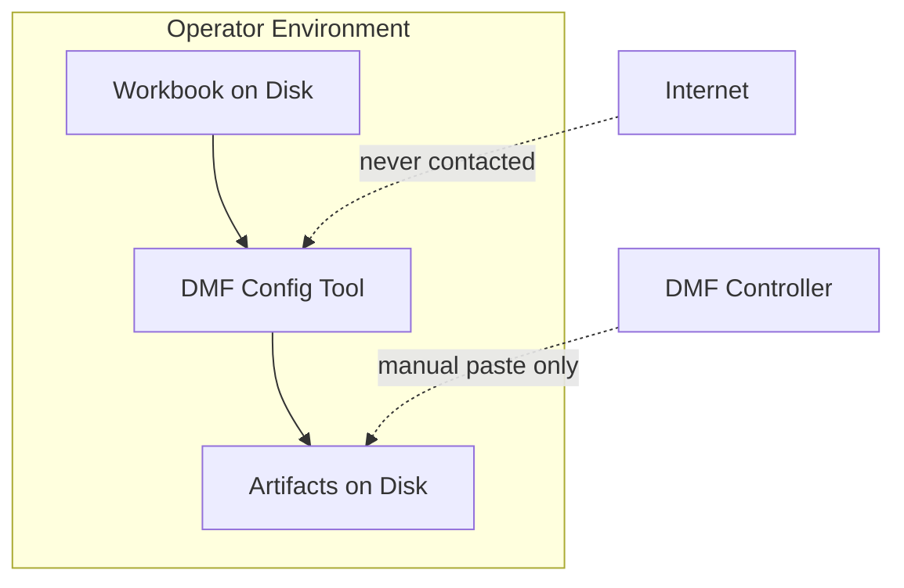
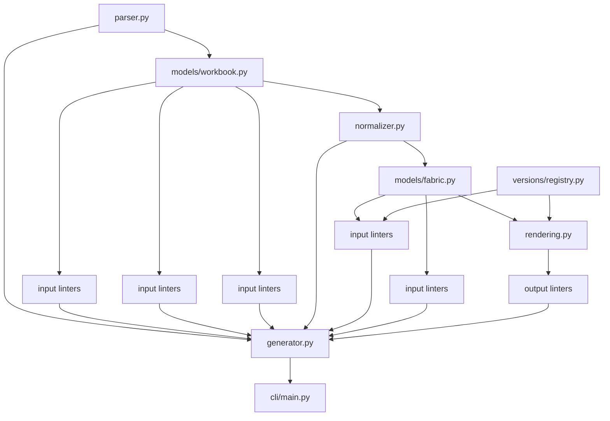

# Architecture

## Pipeline Flow

```mermaid
flowchart LR
    A[Workbook .xlsx] --> B[Acceptance Checks]
    B --> C[Parser]
    C --> D[RawWorkbook]
    D --> E[Structural Linter]
    E --> F[Normalizer]
    F --> G[Fabric]
    G --> H[Schema Linter]
    H --> I[Relational Linter]
    I --> J[Semantic Linter]
    J --> K[Best Practice Linter]
    K --> L[Renderer]
    L --> M[Output Verification]
    M --> N[Artifact Writer]
```

## Trust Boundary

The tool accepts local files and emits local files. No controller API, socket, DNS lookup, or external template fetch crosses this boundary.

## Component Diagram

## Artifact Classification

| Artifact | Sensitive | Why |
| --- | --- | --- |
| `findings.json` | No | Structured diagnostics only |
| `findings.txt` | No | Human-readable diagnostics only |
| `summary.md` | No | Operational summary with warnings only |
| `cli-config.txt` | Yes | Contains real secret values |
| `cli-config-redacted.txt` | No | Secrets replaced with redaction markers |

## Version Bundles

Version bundles isolate DMF-version-specific behavior. Each bundle defines:

- supported feature flags
- capacity limits
- minimum workbook schema version
- the template directory used for rendering

The current implementation includes bundles for `8.6`, `8.7`, and `8.8`. The `8.6` and `8.7` bundles currently reuse the `8.8` template set conservatively while still applying their own feature and limit checks.

## Output Writing Strategy

Artifacts are written to a temporary sibling directory first. Once all writes succeed, that directory is moved into the final timestamped output path. This avoids partially populated run directories.
